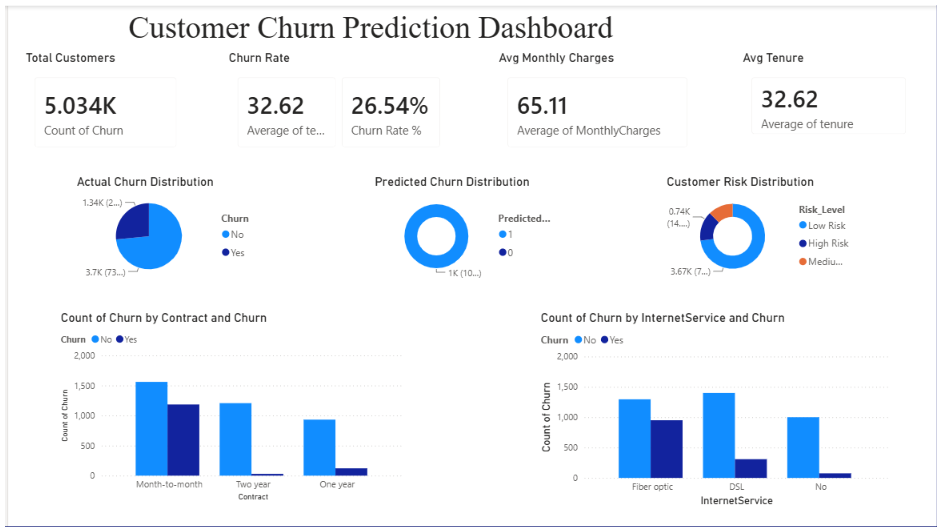
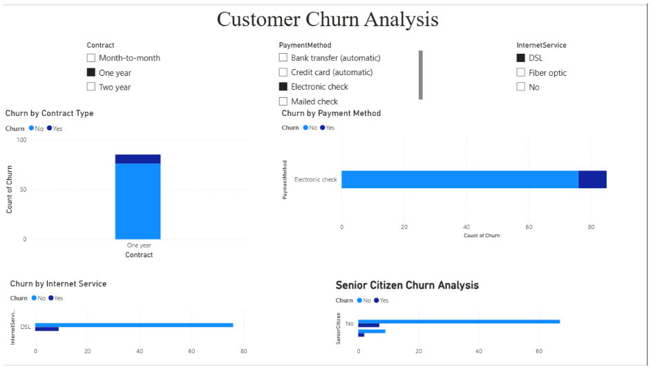
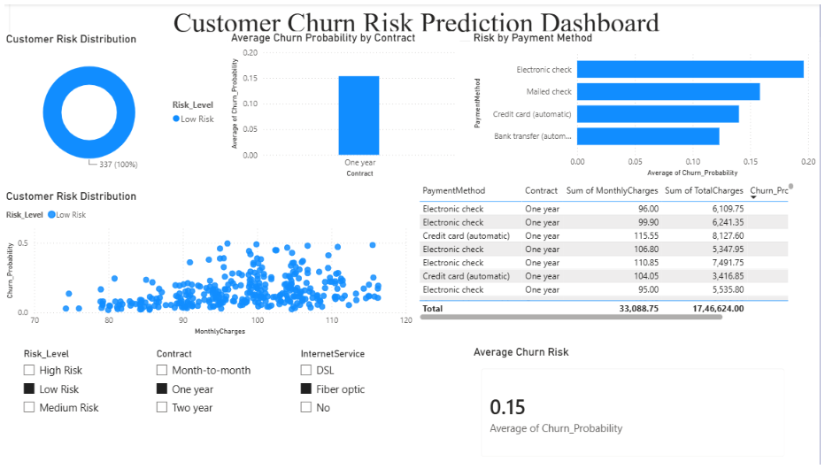
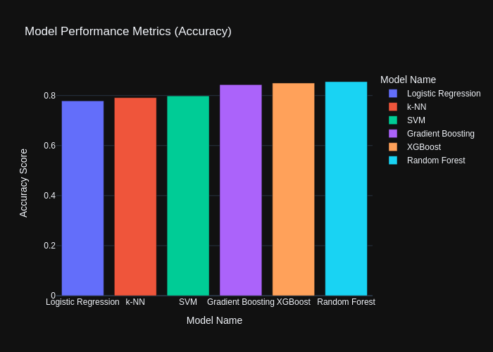
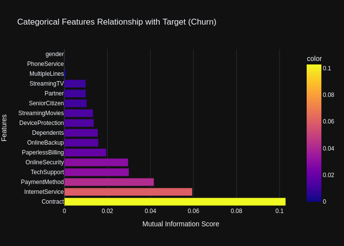

# Customer Churn Classification

## Project Overview

Customer retention is a critical challenge for subscription-based businesses. This project focuses on predicting customer churn for a telecommunications company using supervised machine learning techniques.

The objective is to identify customers who are likely to leave the service, enabling businesses to take proactive retention measures and improve customer satisfaction.

---

## Business Problem

Customer churn directly impacts revenue and growth. By analyzing customer demographics, service usage patterns, contract details, and billing information, this project builds a predictive model that classifies whether a customer is likely to churn.

---

## Project Objectives

- Perform exploratory data analysis (EDA) to understand churn behavior.
- Identify key factors influencing customer attrition.
- Build and evaluate multiple classification models.
- Improve model performance through feature engineering and hyperparameter tuning.
- Generate actionable business insights for customer retention strategies.

---

## Technologies Used


- Python
- Pandas, NumPy
- Scikit-learn (6 classifiers, preprocessing, model selection)
- XGBoost
- imbalanced-learn (SMOTE)
- Matplotlib, Seaborn, Plotly
- SciPy, StatsModels
- Joblib
- OpenPyXL
- Jupyter Notebook
- VS Code

---

## Dataset

The dataset contains customer demographic information, account details, subscribed services, billing information, and churn status.

### Target Variable

| Variable | Description                                            |
| -------- | ------------------------------------------------------ |
| Churn    | Indicates whether a customer left the service (Yes/No) |

### Key Features

- Customer tenure
- Contract type
- Monthly charges
- Total charges
- Internet service
- Online security
- Tech support
- Payment method
- Partner and dependent status

---

## Project Workflow

### 1. Data Understanding

- Examined dataset structure and feature distributions.
- Identified missing values and data quality issues.

### 2. Data Cleaning & Preprocessing

- Handled missing and inconsistent values.
- Converted categorical variables into numerical representations.
- Scaled numerical features where required.

### 3. Exploratory Data Analysis (EDA)

- Univariate analysis
- Bivariate analysis
- Correlation analysis
- Churn distribution analysis

### 4. Handling Class Imbalance

- Applied SMOTE (Synthetic Minority Oversampling Technique) to balance the dataset.

### 5. Feature Engineering

- Encoded categorical variables.
- Selected relevant features for model training.

### 6. Model Building

Trained and evaluated 6 classification models:

- Logistic Regression
- K-Nearest Neighbors
- Random Forest
- Support Vector Machine (SVM)
- Gradient Boosting
- XGBoost

### 7. Hyperparameter Tuning

- Optimized model performance using parameter tuning techniques.

### 8. Model Evaluation

Evaluated models using:

- Accuracy
- Precision
- Recall
- F1 Score
- Confusion Matrix

---

## Results

### Best Performing Model

- Random Forest Classifier

### Performance

- Achieved approximately **86% accuracy** on the test dataset after hyperparameter tuning.

---

## Key Insights

- Customer tenure is one of the strongest predictors of churn.
- Customers on month-to-month contracts are significantly more likely to churn.
- Customers with longer-term contracts show higher retention rates.
- Availability of technical support and online security services positively impacts customer retention.
- Ensemble learning models outperform individual classifiers for this dataset.

---

## Business Recommendations

### Improve Early Customer Experience

Most churn occurs during the initial months of service. Enhancing onboarding, customer support, and issue resolution can improve retention.

### Encourage Long-Term Contracts

Providing incentives for annual or multi-year plans can reduce churn rates.

### Promote Support Services

Customers using technical support and security-related services tend to remain with the company longer.

---

## Dashboards

### Executive Summary



### Churn Analysis



### ML Prediction Dashboard



---

## Model Performance Screenshots

### Model Performance Accuracy



### Mutual Information Plot



---

## Repository Structure

```text
├── Dataset/
│   ├── LP2_Telco_churn_first_3000.csv
│   ├── LP2_Telco-churn-last-2000.csv
│   ├── Telco-churn-second-2000.csv
│   ├── Train_Data.csv
│   ├── Test_Data.csv
│   └── predictions.csv
├── Toolkit/
│   ├── ChurnPredictor.joblib
│   └── Random Forest Classifier.joblib
├── Dashboard-images/
│   ├── churn-analysis.png
│   ├── executive-summary.png
│   └── ml-prediction-dashboard.png
├── Screenshots/
│   ├── Model_Performance_Accuracy.png
│   └── Mutual_information_plot.png
├── .gitignore
├── Project_notebook.ipynb
├── churn-prediction.pbix
├── powerbi_churn_predictions.csv
├── requirements.txt
└── README.md
```

## How to Run

### Clone Repository

```bash
git clone <repository-url>
cd customer-churn-prediction
```

### Create Virtual Environment

```bash
python -m venv venv
```

### Activate Environment

**Windows**

```bash
venv\Scripts\activate
```

**Linux / macOS**

```bash
source venv/bin/activate
```

### Install Dependencies

```bash
pip install -r requirements.txt
```

### Run Notebook

```bash
jupyter notebook
```

---

## Learning Outcomes

Through this project, I gained hands-on experience in:

- Data Cleaning
- Exploratory Data Analysis
- Feature Engineering
- Handling Imbalanced Datasets
- Classification Algorithms
- Model Evaluation
- Hyperparameter Tuning
- Business-Oriented Data Interpretation

---

## Project Summary

Built an end-to-end machine learning pipeline to predict telecom customer churn using customer demographics, service usage, and billing information.

**Key Results:**

- Trained and compared 6 classification models
- Applied SMOTE to address class imbalance
- Performed feature engineering and hyperparameter tuning
- Achieved ~86% accuracy using Random Forest Classifier
